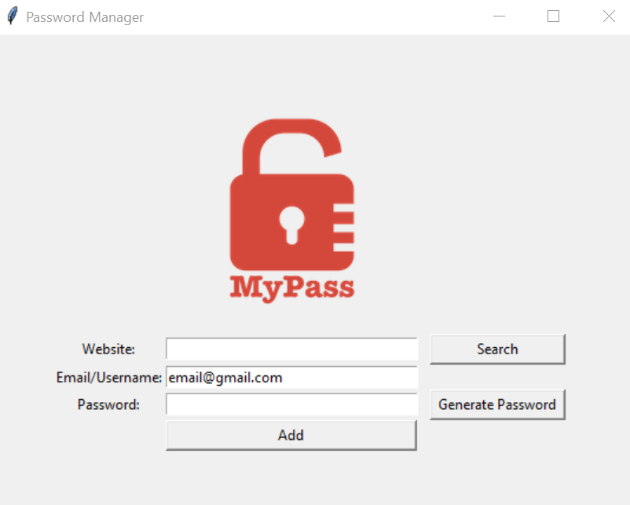

# Password Manager

A simple yet effective Password Manager built with Python using the `tkinter` library. This application helps users generate strong, random passwords and securely save them to a local file.

## Features
- **Password Generator**: Generates strong passwords with a mix of letters, symbols, and numbers.
- **Data Validation**: Ensures that all fields are filled and that the email contains an '@' before saving.
- **Secure Data Storage**: Saves passwords along with the associated website and email/username to a text file.

## Prerequisites
- Python 3.x installed on your machine.
- `tkinter` (comes pre-installed with Python).

## Installation
1. Clone the repository:
   ```bash
   git clone https://github.com/praharaj-ashutosh/password-manager.git
   cd password-manager
   ```
2. Ensure you have the following folder structure:
   ```
   /password-manager
   ├── images/
   │   └── logo.png  # Place your application logo here
   ├── main.py       # The main script file
   └── README.md     # This file
   ```

3. Run the script:
   ```bash
   python main.py
   ```

## How to Use
1. Enter the **website** name.
2. Enter your **email/username** (pre-filled with a default email).
3. Click **Generate Password** to create a random password or enter your own.
4. Click **Add** to save the website, email, and password to `data.txt`.

### Example Data Format in `data.txt`:
```
example.com | user@example.com | P@ssw0rd12345
```

## Project Structure
- **Password Generator**: Creates random passwords with 10 letters, 5 symbols, and 5 numbers.
- **Save Data**: Validates input fields and appends the data to `data.txt` in a user-friendly format.
- **UI**: Built with `tkinter`, featuring labels, entry fields, and buttons for user interaction.

## Dependencies
- `tkinter` (built into Python)
- `random` (built-in module)

## Screenshot


## Contribution
Feel free to fork this repository, make changes, and submit a pull request. Suggestions and contributions are welcome!

## License
This project is licensed under the MIT License. See the `LICENSE` file for details.
